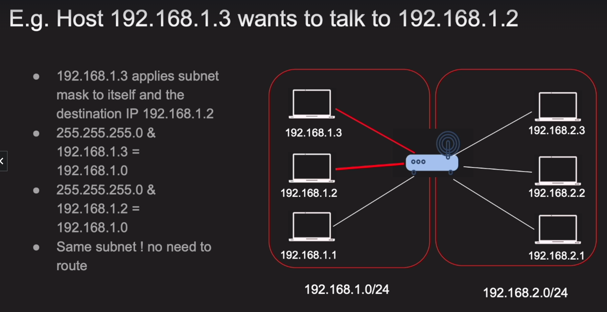

# Internet protocol

## IP Building blocks:
Before we start talking about IP, we need to understand the building blocks of IP and clearify these following questions:

1. What happens when you type a URL in your browser?
2. What happens when you actually route a packet?
3. What happens when you send a packet from your computer to another computers ( servers ) ?

I'm mentioning the word <b>`Packet`</b> here, because I want you to understand that packet is layer 3 of the OSI model, and it's the layer where IP works on.

That means packet is the bunch of data with destination and source IP addresses.

It can contain headers, json, images, videos, etc. in binary format usually.

But for the router, it's just a IP packet that's being routed to another router. Which we can say one server to another server.

### IP Address:
- Layer 3 property
- Can be public or private
- Can be set static or dynamic
- Network and host portion
- 32 bit address (IPv4) or 128 bit address (IPv6)

Well I'm not going to talk about IP address in details, because it's not the main topic here,

But I want you to understand that IP address is the address of your computer in the network, and it's the address that you use to communicate with other computers in the network.

### CIDR notation:
- CIDR stands for Classless Inter-Domain Routing
- It's a way to represent a subnet ( Basically an IP address with a mask )
- Compressed way to representing the range of IP addresses.
- Example: 
- 

### Network vs Host:
- Network portion is the part of the IP address that is the same for all hosts in the network.
- a,b,c,d/x (a,b,c,d are the network portion and x is the host portion) foe can example: 192.168.253.0/24
- likewise, first 3 octets (24bits - 3bytes) are the network portion and the rest octet (8bits - 1byte) is the host portion
- Example: 
- Also known as subnet
- The subnet has mask, which is the number of bits that are set to 1 in the subnet mask
- Subnet mask is used to determine the network portion and the host portion

### Default Gateway:
- Most consists of hosts and default gateway
- When a host wants to communicate with another host in the same network, it will send the packet directly to the destination host if both hosts are in the same subnet (same network portion) or else it will send the packet to the default gateway
- A gateway has an IP address and each host has a default gateway

### The anatomy of a IP packet:
As a backend engineers and frontend engineers, we look at IP packets differently. Just as a bunch of data. but It is good to know how it looks like from network engineer's perspective.

<b>`IP Packet`</b>: contains the following fields:
- Headers and data
- Header is 20 bytes long can go up to 60 bytes if options are used
- Data can be up to 65,535 bytes long

### VPC (Virtual Private Cloud):
-> The idea behind VPC kinda similer to how we think of walls around the data center. In data center walls act as a boundry between infra. and outer world. In VPC, we have a virtual wall around our infra. and that's why it's called VPC.

-> VPC keeps your resources safe from the outer world. It's like a private network in the cloud.

### Internet Gateway:
-> Internet gateway is a gateway that connects your VPC to the internet. It's like a door of your VPC. It's the only way to get in and out of your VPC.