Here we are going to create our first VPC along with 2 subnets (public and private) and an internet gateway.

1. Go to AWS console and search for VPC and click on it.
   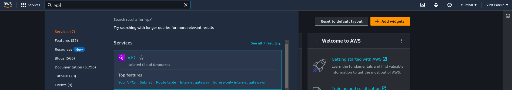

3. Click on `Create VPC` button and configure it as follows:
   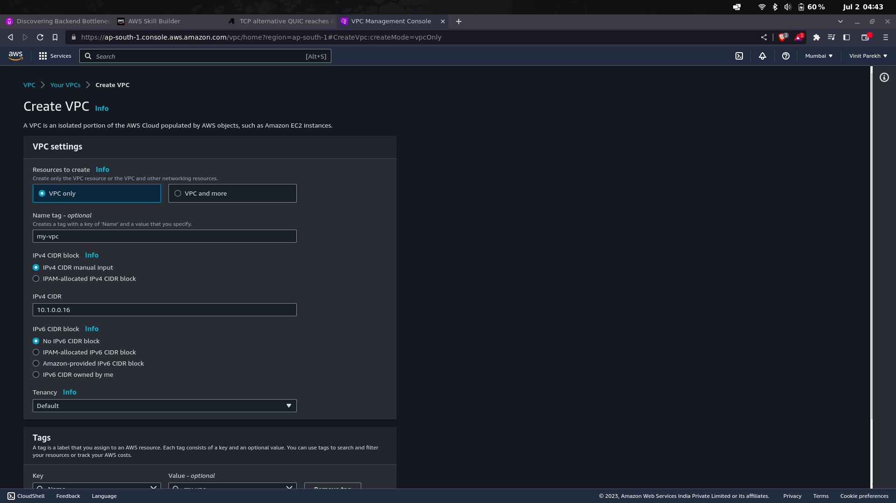

   Above We configured the VPC to have the following properties:
    - Resources to create: `VPC Only`
    - Name: `my-vpc`
    - IPv4 CIDR block: `manual` and entered `10.1.0.0.16`  
    (which is our IP address range for our VPC.)

5. Then click on `Create VPC` button and wait for it to be created.

6. Now we have our VPC created, let's create our first subnet.

   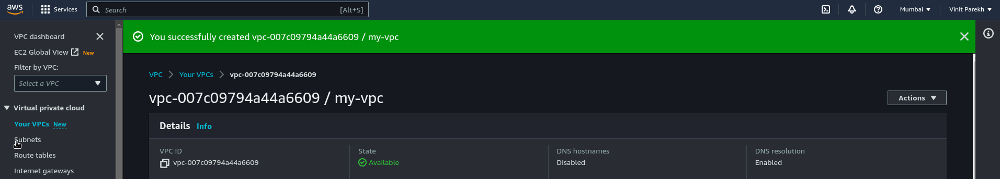

7. Select the AZ same as your VPC.
   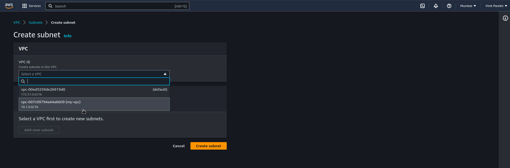

8. Configure 2 subnets as follows:
   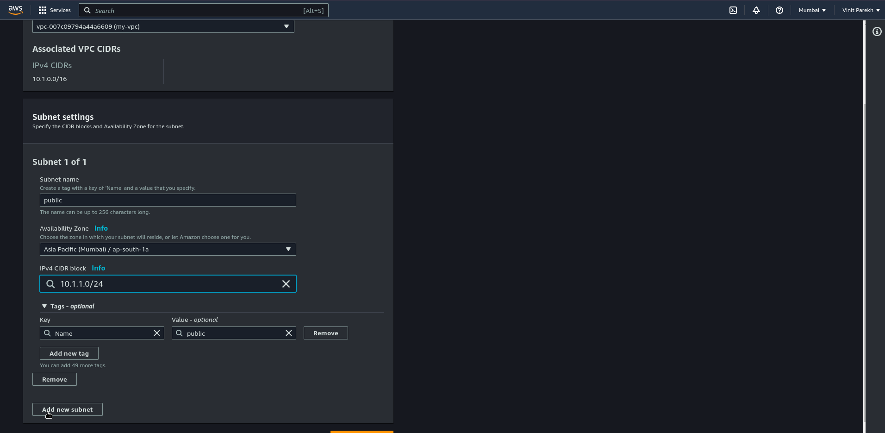
    Name: `public`  
    IPv4 CIDR block: `10.1.1.0/24`  
    Availability Zone: Same as your VPC  

    Name: `private`  
    IPv4 CIDR block: `10.1.2.0/24`  
    Availability Zone: Same as your VPC  

9. Click on `Create Subnet` button and wait for it to be created.
   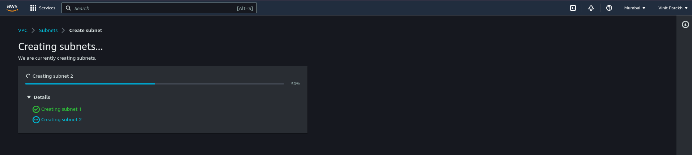

10. Tada! We have our first VPC and subnets created.
   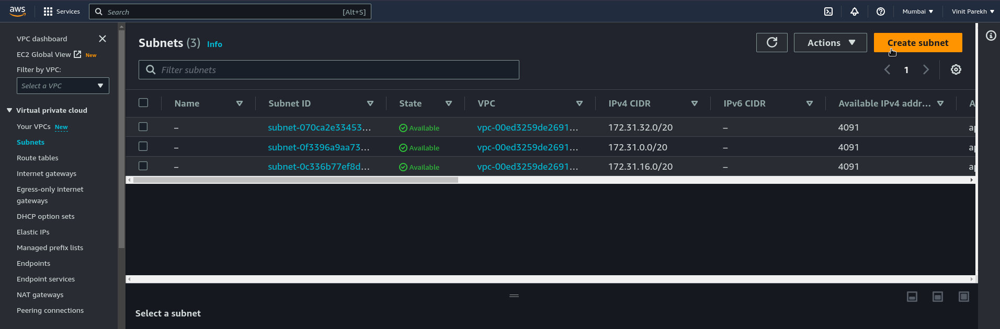

11. Now we need to create an internet gateway.
   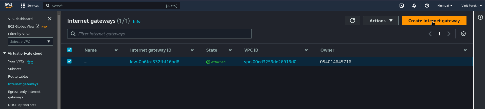

12. Click on `Create Internet Gateway` button and name it.
   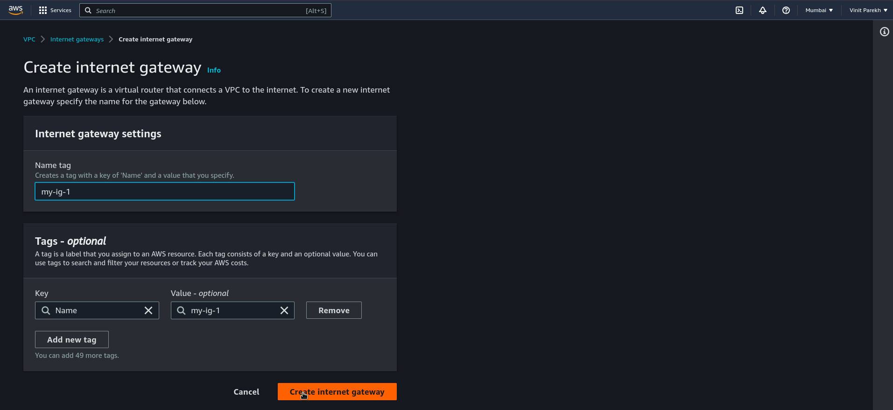

13. Go to actions and click on `Attach to VPC` and select your VPC.
    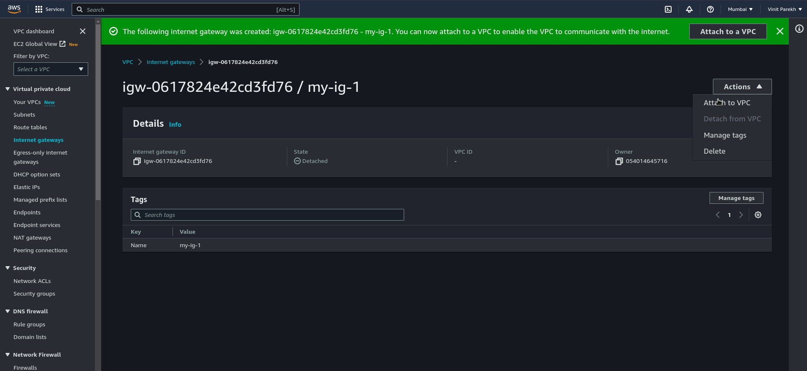

14. Choose your VPC and click on `Attach Internet Gateway` button.
    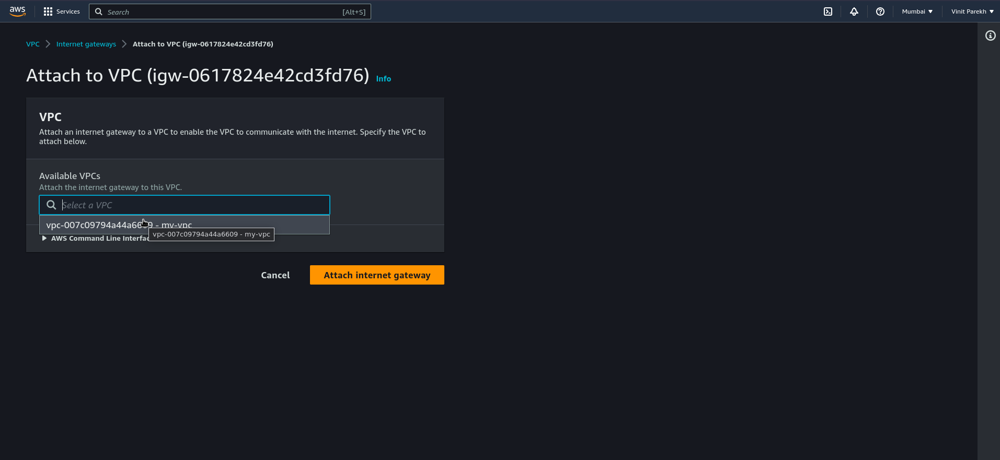

That's it! Hope you enjoyed this guide and successfully created your first VPC and subnets along with an internet gateway.
